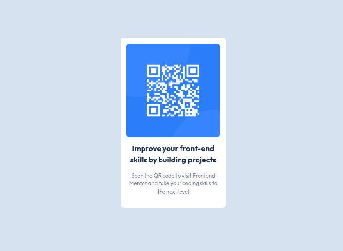

# Frontend Mentor - QR code component solution

This is a solution to the [QR code component challenge on Frontend Mentor](https://www.frontendmentor.io/challenges/qr-code-component-iux_sIO_H). Frontend Mentor challenges help you improve your coding skills by building realistic projects.

I will explain how i did it, on this [blog]()

## Table of contents

- [Overview](#overview)
  - [Screenshot](#screenshot)
  - [Links](#links)
- [My process](#my-process)
  - [Built with](#built-with)
  - [What I learned](#what-i-learned)
  - [Continued development](#continued-development)
  - [Useful resources](#useful-resources)
- [Author](#author)
- [Acknowledgments](#acknowledgments)

## Overview

A simple qr-code component made with html and tailwindcss

### Screenshot



### Links

- List of Solutions and Blog: [Solutions and Blogs](https://eyoelmelesfrontendmentor.netlify.app/)
- Solution URL: [Solution URL](https://github.com/eyoelmeles/frontend-mentor/tree/main/qr-code-component-main)
- Live Site URL: [Live page URL](https://eyoelmelesfrontendmentor.netlify.app/qr-code-component-main/index.html)

## My process

### Built with

- Semantic HTML5 markup
- [Tailwindcss](https://tailwindcss.com/) - For styles
- Flexbox
- Mobile-first workflow

### What I learned

I have struggled for a good 5 minutes to findout why i couldn't center the div to the middle of the screen.

Then i realize the problem was that i was applying flex and all flexbox properties to the body of the html, and that was rendering the website layout differently that what i have written.

The solution i have come up with to not edit the body's style, instead to create a div element and give it the full viewport size, and then apply the styles. this way i got to achieve the results i wanted.

See code snippets, see below:

```html
<!--
This was causing problems

<body class="flex flex-1 justify-center items-center bg-lightgray>
    Content to be centered will go here
</body>
-->
<body>
  <div class="flex w-screen h-screen bg-lightgray justify-center items-center">
    <!-- Content to be centered will go here -->
  </div>
</body>
```

### Continued development

As i am new to tailwind css, i have not give much tought into customizing and configuring tailwindcss, i haven't read the docs, yet. I would like to come back again and make a custom light/dark theme.

### Useful resources

- [Tailwindcss docs](https://tailwindcss.com/docs/) - Tailwind's documentations are very intuitive and easy to learn, if you are new to tailwind css this is the best place to learn styling with tailwindcss.

## Author

- Website - [Eyoel Meles](https://eyoelmeles.github.io)
- Frontend Mentor - [@eyoelmeles](https://www.frontendmentor.io/profile/eyoelmeles)
- Twitter - [@Joel Meles](https://www.twitter.com/joelmcmeles)

## Acknowledgments

I would like to thank the Frontend Mentor team for making these challenges available for every skill level and for free too. I soon want to contribute and help in any way i can.
